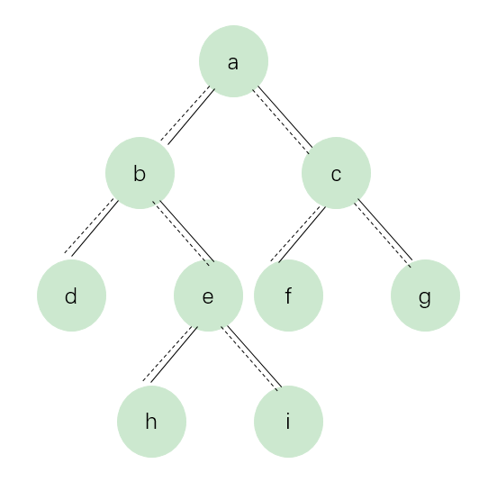

<link href="markdown.css" rel="stylesheet"></link>

## 二叉树的下一个节点 

给定一颗二叉树和其中的一个节点，如何找出中序遍历序列的下一个节点？树中的节点除了有两个分别指向左、右节点的指针，还有一个
指向父节点的指针。  
在图中二叉树的中序遍历序列是{d, b, h, e, i, a, f, c, g}。我们将以这颗树为例来分析如何找出二叉树的下一个节点。
<div align=center></div>  

上图是一颗有9个节点的二叉树。树中从父节点指向子节点的指针用实线表示，子节点指向父节点的指针用虚线表示。  

**解题思路：**  
    
* 如图，如果一个节点有右子树，那么它的下一个节点就是它右子树中的最左子节点。也就是说，从右子节点出发一直沿着指向左子节点的
指针，我们就能找到它的下一个子节点。例如：图中节点 b 的下一个节点是 h ，节点 a 的下一个节点是 f 。    

* 接着我们分析一下一个节点没有有子树的情形。如果节点是它父节点的左子节点，那么它的下一个节点是它的就是它的父节点。例如，图中节点
 d 的下一个节点是 b ，节点 f 的下一个节点是 c 。  
 
 * 如果一个节点既没有右子树，并且它还是它父节点的右子节点，那么这种情形就比较复杂。我们可以沿着指向父节点的指针向上遍历，直到找到
 一个是它父节点的左子节点的节点。如果这样的节点存在，那么这个节点的父节点就是我们要找的下一个节点。例如我们寻找节点 i 的下一个
 子节点，我们沿着指向父节点的指针向上遍历，先到达节点 e 。由于节点 e 还是它父节点 b 的右节点，我们继续向上遍历到达节点 b 。
 节点 b 的父节点 a 就是节点 i 的下一个节点。
 
 ```java

```