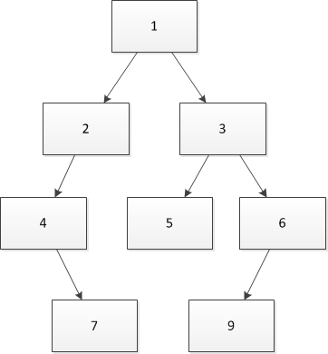
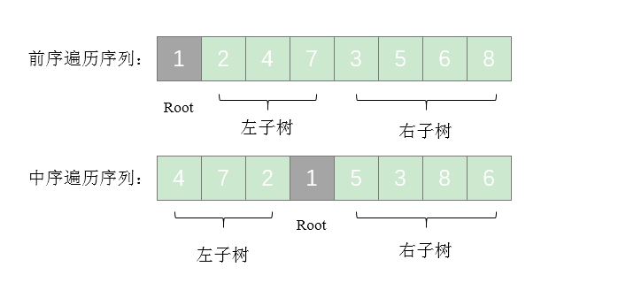

<link href="markdown.css" rel="stylesheet"></link>

## 二叉树的下一个节点 

给定一颗二叉树和其中的一个节点，如何找出中序遍历序列的下一个节点？树中的节点除了有两个分别指向左、右节点的指针，还有一个
指向父节点的指针。  
在图中二叉树的中序遍历序列是{d, b, h, e, i, a, f, c, g}。我们将以这颗树为例来分析如何找出二叉树的下一个节点。
<div align=center></div>
```java
public class TreeNode {

    public int val;
    public TreeNode left;        // 左孩子
    public TreeNode right;       // 右孩子

    public TreeNode(int x){
        this.val = x;
    }
}
```
<div align=center></div>

**解题思路：**    
如图所示，前序遍历序列的第一个数字 1 就是根节点的值。扫描中序遍历序列，就能确定根节点的值的位置。根据中序遍历的特点，在根
节点的值 1 前面的 3 个数字都是左子树节点的值，位于 1 后面的数字都是右子树节点的值。  
由于在中序遍历序列中，有 3 个数字是左子树节点的值，因此左子树共有 3 个左子节点。同样，在前序遍历序列中，根节点后面的 3 个
数字就是 3 个左子树节点的值，再后面的所有数字都是右子树节点的值。这样我们就在前序遍历和中序遍历两个序列中分别找到了左、右
子树对应的子序列。 
<div align=center></div>

```java
public class solution {
    public static TreeNode reConstructBinaryTree(int [] pre, int [] in){
        /**
         * 通过前序遍历数组和中序遍历数组来构建二叉树。
         * @param pre 前序遍历数组
         * @param in 中序遍历数组
         * @return 要得到的二叉树
         */
        // 判断三连
        if(pre == null || in == null){
            return null;
        }
        if(pre.length == 0 || in.length == 0){
            return null;
        }
        if(pre.length != in.length){
            return  null;
        }
        TreeNode root = new TreeNode(pre[0]);
        for(int i = 0; i < pre.length; i++){
             if (pre[0] == in[i]){
                 root.left = reConstructBinaryTree(
                         Arrays.copyOfRange(pre, 1, i+1),
                         Arrays.copyOfRange(in, 0, i)
                 );
                 root.right = reConstructBinaryTree(
                         Arrays.copyOfRange(pre, i+1, pre.length),
                         Arrays.copyOfRange(in, i+1, in.length)
                 );
             }
        }
        return root;
    }
}


