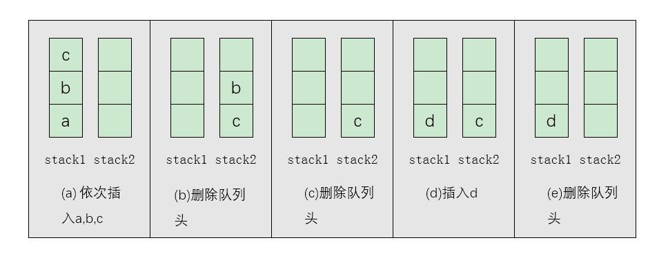

<link href="markdown.css" rel="stylesheet"></link>

## 用两个栈实现队列

用两个栈实现一个队列 

用两个栈实现一个队列。队列的声明如下，请实现它的两个函数 appendTail 和 deleteHead ，分别完成在队列尾部插入节点和在队列头部
删除节点的功能。

<div align=center></div>  
  
**解题思路：**  
    
1. 我们通过一个具体的例子来分析往该队列插入和删除元素的过程。首先插入一个元素a，不妨先插入stack1，此时stack1中的元素有{a}，
stack2为空。再压入两个元素 b 和 c ,还是插入stack1，此时stack1中的元素有{a,b,c}，其中c位于栈顶，而stack2仍然是空的，如图(a)
所示。
2.  
 ```java
public class solution {
    public static TreeLinkNode getNext(TreeLinkNode pNode) {
        if(pNode == null){
            return null;
        }
        // 当前节点有右节点
        if(pNode.right != null){
            TreeLinkNode p = pNode.right;
            while (p.left != null){
                p = p.left;
            }
            return p;
        // 当前节点没有右节点
        }else{
            // 判断是否为根节点
            if(pNode.father == null){
                return null;
            }
            // 判断是否为父节点的左孩子
            while (pNode.father != null){
                if(pNode.father.left == pNode){
                    return pNode.father;
                }
                pNode = pNode.father;
            }
            return null;
        }
    }
}
```