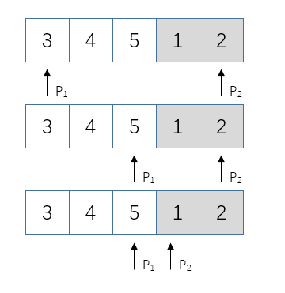

<link href="markdown.css" rel="stylesheet"></link>

## 旋转数组中的最小数字

把一个数组最开始的若干个元素搬到数组的末尾，我们称之为数组的旋转。输入一个递增排序的数组的一个旋转，输出旋转数组的最小值。
例如，数组{3, 4, 5, 1, 2}为{1, 2, 3, 4, 5}的一个旋转，该数组的最小值为1。  
**解题思路：**  
这道题直观的解法不难，从头到尾遍历数组一次，我们就能找出最小的元素。这种思路的时间复杂度显然是O(n)。但是这种思路没有利用
输入的旋转数组的特性，显然达不到面试官的要求。  
该题给出的数组在一定程度上是排序的，因此我们可以试着用二分查找法的思路来寻找这个最小的元素。

<div align=center></div>  

```java
public class solution {
    public static int minNumberRotateArray(int [] array){
        // 日常判断
        if (array.length == 0)
            return 0;
        
        // 用两个指针分别指向数组的第一个元素和最后一个元素
        // 如图
        int begin = 0;
        int end = array.length - 1;
        int mid = (end + begin)/2 + begin;
        int result = -1;

        while (begin < end){
            if (begin == (end-1)){
                result = array[end];
                break;
            }
            // 如果第一个指针与第二个指针指向的值相同，不得不采用顺序查找
            if (array[begin] == array[mid] && array[mid] == array[end]){
                result = findMin(array);
                break;
            /*
            如果中间元素大于或等于第一个指针指向的元素，那么该中间元素
            位于前面的子数组，我们把第一个指针指向该中间元素，这样缩小
            范围。
             */
            }else if (array[mid] >= array[begin]){
                begin = mid;
             /*
            同理继续缩小范围。
             */
            }else if (array[mid] <= array[end]){
                end = mid;
            }
            mid = (end - begin)/2 + begin;
        }
        return result;
    }
    public static int findMin(int[] array){
        int result = -1;
        for (int i=0;i<(array.length-1);i++){
            if (array[i]>array[i+1]){
                result = array[i+1];
                break;
            }
        }
        return result;
    }
}
```